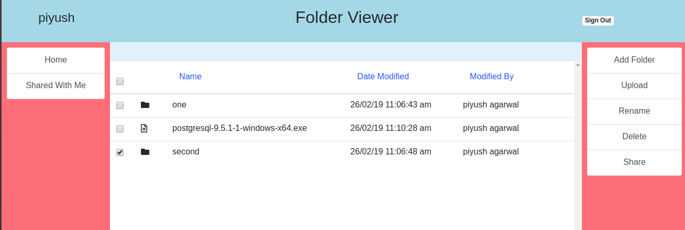
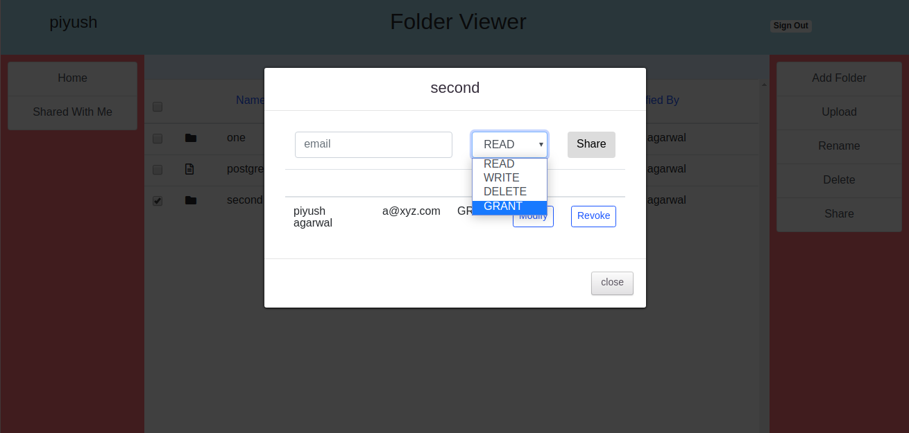

# FolderViewer
This is an application which tries to replicate a cloud storage software like dropbox or google drive.
A registered user could perform the following functionalities:
 - could create directories
 - upload and download files 
 - Grant access to other users on a particular file and control the access permissions granted.
 - The access permissions could be read, write, delete or grant.
 
 ### Design
 
 #### Server
 - The server is written in node.js using express framework.
 - NPM modules like passport.js and formidable has been used.
 - Uses MongoDB as a database.
 
 #### Client 
  - It consists of two single page applications.
  - One for user registration and login
  - Second consists of the main application
  - BACKBONE framework has been used
 
 
 ### To Do
 - Expose UI to modify user details and reset password.
 - Currently, the session key is stored in the server memory. A redis cache could be used for persistence.
 - Provide copy, cut and move functionality.
 - Update the test suite.
 - Increase the maximum supported file size for uploads. Currently, it is 200 MB.
 
 
### Installation
- For the client, all required scripts has been bundled together.

 A configuration file (server.ini) is present where following fields could be specified
- PORT : Application port
- HOST : Application hostname
- DB_NAME
- DB_PORT
- DB_HOST
- DB_USER
- DB_PASSWORD
- DATA_DIRECTORY: The full path of the directory where date(files) would be stored 

To start the server run the following.
 ```sh
 npm install
 npm start
 ```
 ### Screenshots
 
<div>

 <br>

<div>
 
